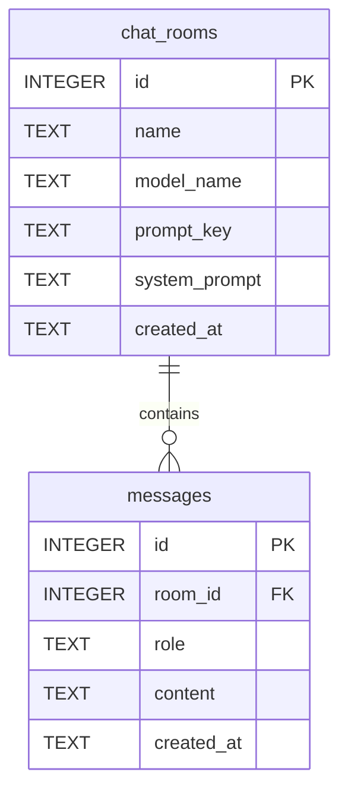

# SQLite Schema and ERD

## Table 1. `chat_rooms`

| Column | Type | Constraints | Description |
| --- | --- | --- | --- |
| `id` | INTEGER | PK, AUTOINCREMENT | 채팅방 고유 ID |
| `name` | TEXT | NOT NULL | 채팅방 이름 |
| `model_name` | TEXT | NOT NULL | 이 채팅방에서 사용할 Groq 모델 |
| `prompt_key` | TEXT | NOT NULL | 선택한 시스템 프롬프트 프리셋 키 |
| `system_prompt` | TEXT | NOT NULL | 프리셋에 대응하는 실제 시스템 프롬프트 |
| `created_at` | TEXT | NOT NULL | 채팅방 생성 시각 |

## Table 2. `messages`

| Column | Type | Constraints | Description |
| --- | --- | --- | --- |
| `id` | INTEGER | PK, AUTOINCREMENT | 메시지 고유 ID |
| `room_id` | INTEGER | NOT NULL, FK -> `chat_rooms.id` ON DELETE CASCADE | 소속 채팅방 |
| `role` | TEXT | NOT NULL, CHECK(`user`, `assistant`) | 메시지 역할 |
| `content` | TEXT | NOT NULL | 메시지 내용 |
| `created_at` | TEXT | NOT NULL | 메시지 생성 시각 |

## Relationships

- `chat_rooms` 1 : N `messages`
- 채팅방 삭제 시 해당 채팅방의 메시지도 함께 삭제된다.
- 대화 비우기는 `messages`만 삭제하고 `chat_rooms`는 유지한다.
- 모델과 시스템 프롬프트는 채팅방별로 1개씩만 저장된다.

## ERD



## SQL DDL

```sql
CREATE TABLE IF NOT EXISTS chat_rooms (
    id INTEGER PRIMARY KEY AUTOINCREMENT,
    name TEXT NOT NULL,
    model_name TEXT NOT NULL,
    prompt_key TEXT NOT NULL,
    system_prompt TEXT NOT NULL,
    created_at TEXT NOT NULL DEFAULT (CURRENT_TIMESTAMP)
);

CREATE TABLE IF NOT EXISTS messages (
    id INTEGER PRIMARY KEY AUTOINCREMENT,
    room_id INTEGER NOT NULL,
    role TEXT NOT NULL CHECK(role IN ('user', 'assistant')),
    content TEXT NOT NULL,
    created_at TEXT NOT NULL DEFAULT (CURRENT_TIMESTAMP),
    FOREIGN KEY (room_id) REFERENCES chat_rooms(id) ON DELETE CASCADE
);
```
